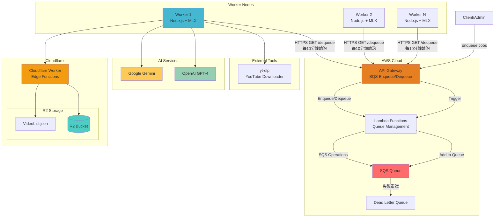
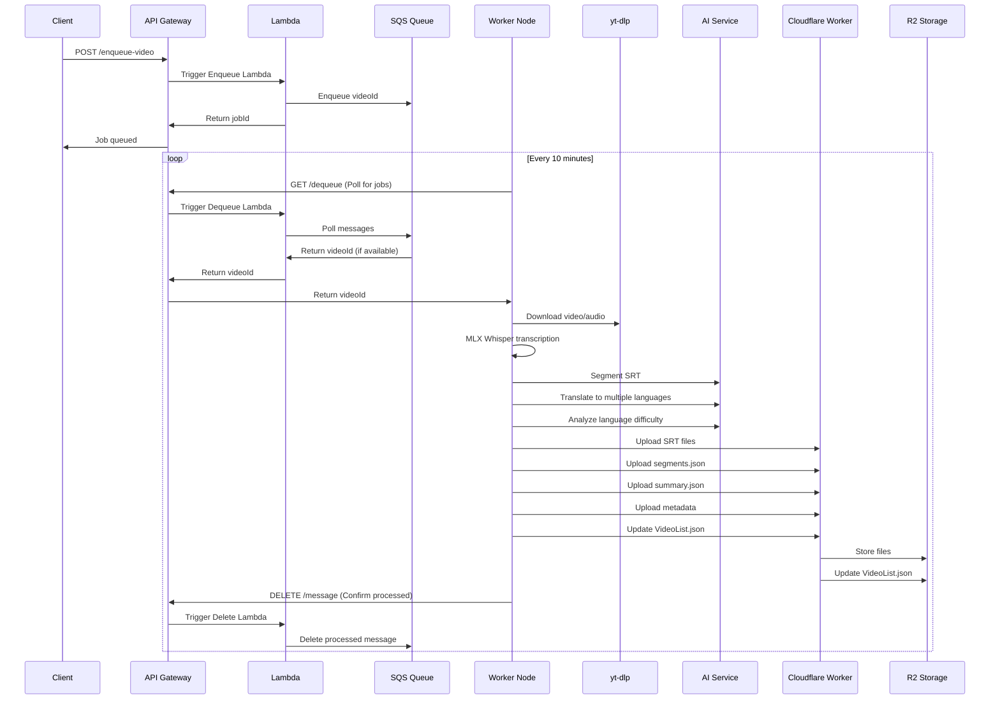

# Whisper 影片處理流水線

> YouTube 影片自動轉錄、翻譯、分段服務

## 🎯 簡介

這個專案用 Whisper AI 處理 YouTube 影片，產出多語言字幕。整個流程從下載影片到上傳結果都是自動化的，透過 SQS 佇列管理任務。

### 主要功能
- **🤖 自動化處理** - 丟 video ID 進 SQS，剩下的交給 worker
- **🏗️ Clean Architecture** - 分層架構，方便維護和測試
- **🌐 多語言字幕** - 轉錄後自動翻譯成指定語言
- **☁️ 雲端儲存** - Cloudflare R2 存檔，AWS SQS 排程
- **⚡ MLX Whisper** - Apple Silicon 上跑得飛快
- **📊 語言難度分析** - 分析內容適合什麼程度的學習者

## 🔄 架構

### 系統架構圖



### 處理流程



### 處理步驟

1. **📥 入隊** - 把 YouTube video ID 丟進 SQS
2. **🔄 輪詢** - Worker 每 10 分鐘去 API Gateway 拿任務
3. **⬇️ 下載** - 用 `yt-dlp` 抓音檔和 metadata
4. **🎙️ 轉錄** - MLX Whisper 產生 SRT 字幕
5. **✂️ 分段** - GPT/Gemini 把長字幕切成主題段落
6. **🌍 翻譯** - 翻成 zh-TW、ja、ko 等語言
7. **📈 分析** - 評估內容的語言難度
8. **☁️ 上傳** - 存到 Cloudflare R2
9. **📋 更新索引** - 更新 VideoList.json

## 🚀 快速開始

### 環境需求

- **Node.js** 18+ 
- **Python** 3.11+ (MLX Whisper 需要)
- **Apple Silicon** (M1/M2/M3，跑 MLX 才快)
- **uv/uvx** (Python 套件管理)

### 安裝

1. **Clone**
```bash
git clone <repository-url>
cd whisper-node-backend
```

2. **裝套件**
```bash
npm install
```

3. **Python 環境**
```bash
# 裝 uv
curl -LsSf https://astral.sh/uv/install.sh | sh

# MLX Whisper 第一次跑會自動裝
```

4. **設定環境變數**
```bash
cp .env.example .env
# 改 .env 裡的 API key 和儲存設定
```

5. **啟動**
```bash
# 開發模式
npm run dev

# Production
npm run build
npm start
```

### 環境變數

```bash
# Server
PORT=8001

# Storage
STORAGE_TYPE=r2                    # local | r2
R2_BUCKET_NAME=your_bucket_name

# AI
OPENAI_API_KEY=your_openai_key
GEMINI_API_KEY=your_gemini_key
AI_PROVIDER=gemini                 # openai | gemini

# SQS 自動處理
SQS_AUTO_SEGMENT=true             # 自動分段
SQS_AUTO_TRANSLATE=true           # 自動翻譯
SQS_AUTO_LANGUAGE_ANALYSIS=true   # 自動分析難度
SQS_TARGET_LANGUAGES=zh-TW,ja,ko  # 翻譯目標語言
SQS_SEGMENT_COUNT=6               # 分幾段
SQS_AI_SERVICE=gemini             # 用哪個 AI
```

## 📡 API

### 轉錄

```bash
# YouTube 影片轉錄
POST /api/transcribe-youtube-mlx
Content-Type: application/json
{
  "url": "https://www.youtube.com/watch?v=VIDEO_ID",
  "language": "auto"
}

# 上傳音檔轉錄
POST /api/transcribe-mlx
Content-Type: multipart/form-data
# 上傳 WAV 檔

# YouTube 直接轉 SRT
POST /api/youtube-to-srt
{
  "url": "https://www.youtube.com/watch?v=VIDEO_ID"
}
```

### SRT 處理

```bash
# 分段
POST /api/srt/segment
{
  "videoId": "VIDEO_ID",
  "language": "default",
  "targetSegmentCount": 6,
  "aiService": "gemini"
}

# 翻譯
POST /api/srt/translate
{
  "videoId": "VIDEO_ID",
  "sourceLanguage": "default",
  "targetLanguage": "zh-TW",
  "aiService": "gemini"
}

# 拿分段結果
GET /api/srt/segmentation/{videoId}/{language}

# 拿 SRT
GET /api/srt/{videoId}/{language}
```

### 批次處理

```bash
# 批次處理多支影片
POST /api/batch/process-multiple
{
  "videoIds": ["VIDEO_ID_1", "VIDEO_ID_2"],
  "options": {
    "autoSegment": true,
    "autoTranslate": true,
    "targetLanguages": ["zh-TW", "ja"]
  }
}

# 從 R2 VideoList 批次處理
POST /api/batch/process-from-r2

# 查任務狀態
GET /api/batch/status/{jobId}

# 列出所有任務
GET /api/batch/jobs
```

### 語言分析

```bash
# 批次分析難度
POST /api/batch-analyze-language-level
{
  "videoIds": ["VIDEO_ID_1", "VIDEO_ID_2"],
  "aiService": "gemini"
}

# 拿分析結果
GET /api/language-analysis/{videoId}

# 統計資料
GET /api/language-analysis/stats
```

### R2 狀態檢查

```bash
# 檢查所有影片狀態
GET /api/r2/check-status

# 列出缺資料的影片
GET /api/r2/missing-data

# 產生狀態報告
GET /api/r2/status-report
```

## 🔧 開發

### 專案結構

```
src/
├── controllers/          # HTTP/WebSocket 控制器
├── usecases/            # 業務流程
├── services/            # 核心邏輯
├── infrastructure/      # 外部服務
│   └── repositories/    # 儲存抽象層
├── domain/             # Entity 和 Interface
├── types/              # TypeScript 型別
├── utils/              # 工具函數
├── socket/             # Socket.IO handler
└── config/             # 設定檔
```

### 加新功能

1. **定義型別** - `src/types/` 加型別
2. **寫 Service** - `src/services/` 實作邏輯
3. **寫 Use Case** - `src/usecases/` 串流程
4. **寫 Controller** - `src/controllers/` 處理請求
5. **註冊路由** - `src/app.ts` 加 endpoint

### 開發指令

```bash
npm run dev              # 開發模式（自動重載）
npm run build            # 編譯 TypeScript
npm run type-check       # 型別檢查
npm test                 # 跑測試
```

## 🐳 部署

### Docker

```bash
# Build
docker build -t whisper-backend .

# Run
docker run -d \
  --name whisper-backend \
  -p 8001:8001 \
  -v $(pwd)/uploads:/app/uploads \
  --env-file .env \
  whisper-backend
```

### Docker Compose

```yaml
version: '3.8'
services:
  whisper-backend:
    build: .
    ports:
      - "8001:8001"
    volumes:
      - ./uploads:/app/uploads
      - ./models:/app/models
    env_file:
      - .env
    restart: unless-stopped
```

### Production 設定

1. **環境變數** - 設好 R2 和 AI API key
2. **SQS** - 建 AWS SQS queue 和 API Gateway
3. **Load Balancing** - Nginx 或 CloudFlare
4. **Monitoring** - CloudWatch 或其他監控

## 📊 監控

### Health Check

```bash
# 基本檢查
GET /health

# MLX Whisper 狀態
GET /api/mlx-health
```

### Log

- **SQS 處理** - 任務取得和處理狀態
- **轉錄進度** - MLX Whisper 處理進度
- **AI 呼叫** - OpenAI/Gemini API 狀態
- **儲存操作** - R2 上傳下載狀態

## 🤝 貢獻

1. Fork
2. 開 branch (`git checkout -b feature/xxx`)
3. Commit (`git commit -m 'Add xxx'`)
4. Push (`git push origin feature/xxx`)
5. 開 PR

## 📄 License

MIT License
