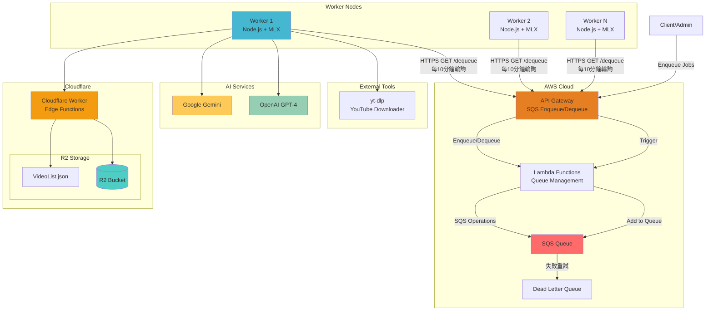
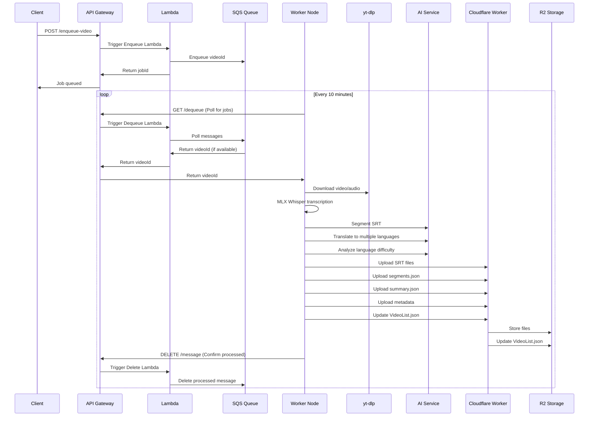

# Whisper AI Video Processing Pipeline

> 企業級 AI 驅動的 YouTube 影片處理系統，採用 Clean Architecture 和事件驅動架構

## 🎯 系統概述

這是一個基於 Whisper AI 的自動化影片處理平台，實現了從 YouTube 影片到多語言字幕的完整工作流程。系統採用微服務架構，支援水平擴展和容錯處理。

### 核心特色
- **🤖 全自動化處理管道** - SQS 驅動的無人值守影片處理
- **🏗️ Clean Architecture** - 嚴格的分層架構和依賴注入
- **🌐 多語言支援** - AI 驅動的智能翻譯和分段
- **☁️ 雲原生設計** - Cloudflare R2 儲存 + AWS SQS 佇列
- **⚡ 高效能轉錄** - MLX Whisper (Apple Silicon 優化)
- **📊 語言難度分析** - AI 評估內容學習難度

## 🔄 雲端架構與工作流程

### 系統架構圖



### 處理流程詳解



### 處理階段詳解

1. **📥 任務入隊** - 客戶端透過 API Gateway 將 YouTube 影片 ID 加入 SQS 佇列
2. **🔄 HTTP 輪詢** - Worker 節點每 10 分鐘透過 HTTPS GET 請求呼叫 API Gateway `/dequeue` 端點
3. **⬇️ 影片下載** - 使用 `youtube-dl-exec` 下載音頻和元數據
4. **🎙️ 語音轉錄** - MLX Whisper 生成高精度 SRT 字幕
5. **✂️ 智能分段** - OpenAI/Gemini AI 將長字幕分割成主題段落
6. **🌍 多語言翻譯** - 自動翻譯至目標語言 (zh-TW, ja, ko 等)
7. **📈 語言分析** - AI 評估內容的語言學習難度
8. **☁️ 雲端儲存** - 結構化上傳至 Cloudflare R2
9. **📋 索引更新** - 更新 VideoList.json 主索引

## 🚀 快速開始

### 環境需求

- **Node.js** 18+ 
- **Python** 3.11+ (MLX Whisper 需求)
- **Apple Silicon** (M1/M2/M3 推薦，MLX 優化)
- **uv/uvx** (Python 套件管理)

### 安裝步驟

1. **克隆專案**
```bash
git clone <repository-url>
cd whisper-node-backend
```

2. **安裝依賴**
```bash
npm install
```

3. **Python 環境設置**
```bash
# 安裝 uv (Python 套件管理器)
curl -LsSf https://astral.sh/uv/install.sh | sh

# MLX Whisper 會在首次使用時自動安裝
```

4. **環境變數配置**
```bash
cp .env.example .env
# 編輯 .env 設定 API 金鑰和儲存配置
```

5. **啟動服務**
```bash
# 開發模式 (自動重載)
npm run dev

# 生產模式
npm run build
npm start
```

### 環境變數配置

```bash
# 伺服器配置
PORT=8001

# 儲存配置
STORAGE_TYPE=r2                    # local | r2
R2_BUCKET_NAME=your_bucket_name

# AI 服務配置
OPENAI_API_KEY=your_openai_key
GEMINI_API_KEY=your_gemini_key
AI_PROVIDER=gemini                 # openai | gemini

# SQS 自動處理配置
SQS_AUTO_SEGMENT=true             # 自動分段
SQS_AUTO_TRANSLATE=true           # 自動翻譯
SQS_AUTO_LANGUAGE_ANALYSIS=true   # 自動語言分析
SQS_TARGET_LANGUAGES=zh-TW,ja,ko  # 目標翻譯語言
SQS_SEGMENT_COUNT=6               # 目標分段數量
SQS_AI_SERVICE=gemini             # AI 服務選擇
```

## 📡 API 端點

### 核心轉錄 API

```bash
# YouTube 影片轉錄 (MLX Whisper)
POST /api/transcribe-youtube-mlx
Content-Type: application/json
{
  "url": "https://www.youtube.com/watch?v=VIDEO_ID",
  "language": "auto"
}

# 音頻檔案轉錄
POST /api/transcribe-mlx
Content-Type: multipart/form-data
# 上傳 WAV 檔案

# YouTube 轉 SRT 字幕
POST /api/youtube-to-srt
{
  "url": "https://www.youtube.com/watch?v=VIDEO_ID"
}
```

### SRT 處理 API

```bash
# SRT 智能分段
POST /api/srt/segment
{
  "videoId": "VIDEO_ID",
  "language": "default",
  "targetSegmentCount": 6,
  "aiService": "gemini"
}

# SRT 翻譯
POST /api/srt/translate
{
  "videoId": "VIDEO_ID",
  "sourceLanguage": "default",
  "targetLanguage": "zh-TW",
  "aiService": "gemini"
}

# 獲取分段結果
GET /api/srt/segmentation/{videoId}/{language}

# 獲取 SRT 內容
GET /api/srt/{videoId}/{language}
```

### 批次處理 API

```bash
# 批次處理多個影片
POST /api/batch/process-multiple
{
  "videoIds": ["VIDEO_ID_1", "VIDEO_ID_2"],
  "options": {
    "autoSegment": true,
    "autoTranslate": true,
    "targetLanguages": ["zh-TW", "ja"]
  }
}

# 從 R2 VideoList 批次處理
POST /api/batch/process-from-r2

# 檢查批次任務狀態
GET /api/batch/status/{jobId}

# 列出所有批次任務
GET /api/batch/jobs
```

### 語言分析 API

```bash
# 批次語言難度分析
POST /api/batch-analyze-language-level
{
  "videoIds": ["VIDEO_ID_1", "VIDEO_ID_2"],
  "aiService": "gemini"
}

# 獲取語言分析結果
GET /api/language-analysis/{videoId}

# 獲取分析統計
GET /api/language-analysis/stats
```

### R2 狀態檢查 API

```bash
# 檢查 R2 上所有影片狀態
GET /api/r2/check-status

# 獲取缺少資料的影片列表
GET /api/r2/missing-data

# 生成狀態報告 (Markdown)
GET /api/r2/status-report
```

## 🔧 開發指南

### 專案結構

```
src/
├── controllers/          # HTTP/WebSocket 控制器
├── usecases/            # 業務流程編排
├── services/            # 核心業務邏輯
├── infrastructure/      # 外部服務整合
│   └── repositories/    # 儲存抽象層
├── domain/             # 領域模型和介面
├── types/              # TypeScript 型別定義
├── utils/              # 工具函數
├── socket/             # Socket.IO 處理器
└── config/             # 配置檔案
```

### 新增功能流程

1. **定義型別** - 在 `src/types/` 建立型別定義
2. **建立服務** - 在 `src/services/` 實作核心邏輯
3. **建立用例** - 在 `src/usecases/` 編排業務流程
4. **建立控制器** - 在 `src/controllers/` 處理 HTTP/WebSocket
5. **註冊路由** - 在 `src/app.ts` 註冊 API 端點

### 開發命令

```bash
npm run dev              # 開發模式 (自動重載)
npm run build            # 編譯 TypeScript
npm run type-check       # 型別檢查
npm test                 # 執行測試
```

## 🐳 部署指南

### Docker 部署

```bash
# 建立映像
docker build -t whisper-backend .

# 執行容器
docker run -d \
  --name whisper-backend \
  -p 8001:8001 \
  -v $(pwd)/uploads:/app/uploads \
  --env-file .env \
  whisper-backend
```

### Docker Compose

```yaml
version: '3.8'
services:
  whisper-backend:
    build: .
    ports:
      - "8001:8001"
    volumes:
      - ./uploads:/app/uploads
      - ./models:/app/models
    env_file:
      - .env
    restart: unless-stopped
```

### 生產環境配置

1. **設定環境變數** - 配置 R2 儲存和 AI API 金鑰
2. **SQS 佇列設定** - 建立 AWS SQS 佇列和 API Gateway
3. **負載均衡** - 使用 Nginx 或 CloudFlare 進行負載均衡
4. **監控設定** - 整合 CloudWatch 或其他監控服務

## 📊 系統監控

### 健康檢查端點

```bash
# 基本健康檢查
GET /health

# MLX Whisper 服務檢查
GET /api/mlx-health
```

### 日誌監控

系統提供詳細的結構化日誌：

- **SQS 處理日誌** - 任務獲取和處理狀態
- **轉錄進度日誌** - MLX Whisper 處理進度
- **AI 服務日誌** - OpenAI/Gemini API 呼叫狀態
- **儲存操作日誌** - R2 上傳/下載狀態

## 🤝 貢獻指南

1. Fork 專案
2. 建立功能分支 (`git checkout -b feature/amazing-feature`)
3. 提交變更 (`git commit -m 'Add amazing feature'`)
4. 推送分支 (`git push origin feature/amazing-feature`)
5. 開啟 Pull Request

## 📄 授權條款

MIT License - 詳見 [LICENSE](LICENSE) 檔案

---

**🎯 專案亮點**
- 企業級 Clean Architecture 設計
- 事件驅動的微服務架構
- AI 驅動的智能內容處理
- 雲原生的可擴展設計
- 完整的自動化工作流程