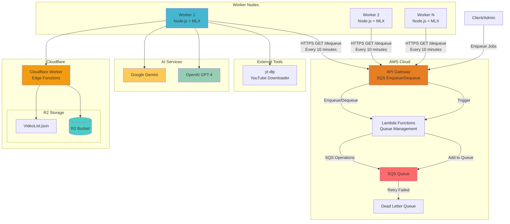
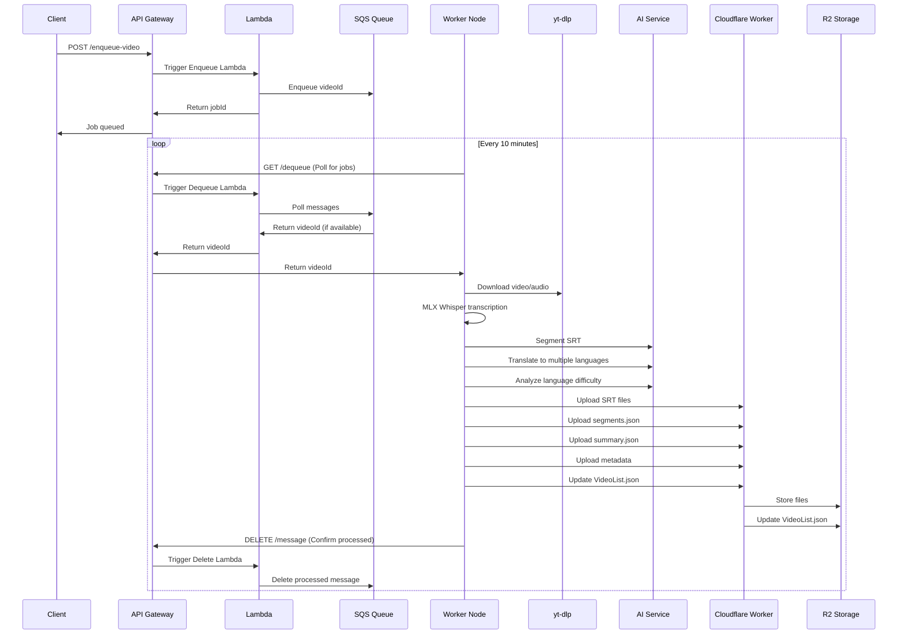

# Whisper Video Processing Pipeline

> Automated YouTube video transcription, translation, and segmentation service

## 🎯 Overview

This project uses Whisper AI to process YouTube videos and generate multilingual subtitles. The entire pipeline from downloading to uploading is automated, with SQS handling job scheduling.

### Features
- **🤖 Automated Processing** - Drop video IDs into SQS, workers handle the rest
- **🏗️ Clean Architecture** - Layered design for maintainability and testing
- **🌐 Multilingual Subtitles** - Auto-translate after transcription
- **☁️ Cloud Storage** - Cloudflare R2 for files, AWS SQS for queuing
- **⚡ MLX Whisper** - Runs fast on Apple Silicon
- **📊 Language Difficulty Analysis** - Assess content difficulty for learners

## 🔄 Architecture

### System Architecture



### Processing Flow



### Pipeline Steps

1. **📥 Enqueue** - Submit YouTube video IDs to SQS
2. **🔄 Poll** - Workers poll API Gateway `/dequeue` every 10 minutes
3. **⬇️ Download** - Fetch audio and metadata via `yt-dlp`
4. **🎙️ Transcribe** - MLX Whisper generates SRT subtitles
5. **✂️ Segment** - GPT/Gemini splits subtitles into topic sections
6. **🌍 Translate** - Convert to zh-TW, ja, ko, etc.
7. **📈 Analyze** - Evaluate language difficulty level
8. **☁️ Upload** - Store to Cloudflare R2
9. **📋 Update Index** - Update VideoList.json

## 🛠️ Tech Stack

- **Backend**: TypeScript + Node.js + Express
- **Transcription**: MLX Whisper (M1/M2/M3 optimized) / Whisper.cpp
- **AI**: OpenAI GPT-4 / Google Gemini
- **Queue**: AWS SQS
- **Storage**: Cloudflare R2 (S3-compatible)
- **Real-time**: Socket.IO
- **Container**: Docker

## 🚀 Quick Start

### Requirements

- **Node.js** 18+
- **Python** 3.11+ (for MLX Whisper)
- **Apple Silicon** (M1/M2/M3 recommended for MLX)
- **uv/uvx** (Python package management)

### Installation

1. **Clone**
```bash
git clone <repository-url>
cd whisper-node-backend
```

2. **Install dependencies**
```bash
npm install
```

3. **Python setup**
```bash
# Install uv (if not installed)
curl -LsSf https://astral.sh/uv/install.sh | sh

# Create venv and install dependencies
uv sync
```

4. **Configure environment**
```bash
cp .env.example .env
# Edit .env with your API keys and storage settings
```

5. **Start**
```bash
# Development
npm run dev

# Production
npm run build
npm start
```

### Environment Variables

```bash
# Server
PORT=8001

# Storage
STORAGE_TYPE=r2                    # local | r2
R2_BUCKET_NAME=your_bucket_name

# AI
OPENAI_API_KEY=your_openai_key
GEMINI_API_KEY=your_gemini_key
AI_PROVIDER=gemini                 # openai | gemini

# SQS auto-processing
SQS_AUTO_SEGMENT=true             # Auto segment
SQS_AUTO_TRANSLATE=true           # Auto translate
SQS_AUTO_LANGUAGE_ANALYSIS=true   # Auto analyze difficulty
SQS_TARGET_LANGUAGES=zh-TW,ja,ko  # Target languages
SQS_SEGMENT_COUNT=6               # Number of segments
SQS_AI_SERVICE=gemini             # Which AI to use
```

## 📡 API

### Transcription

```bash
# YouTube video transcription
POST /api/transcribe-youtube-mlx
Content-Type: application/json
{
  "url": "https://www.youtube.com/watch?v=VIDEO_ID",
  "language": "auto"
}

# Audio file transcription
POST /api/transcribe-mlx
Content-Type: multipart/form-data
# Upload WAV file

# YouTube to SRT
POST /api/youtube-to-srt
{
  "url": "https://www.youtube.com/watch?v=VIDEO_ID"
}
```

### SRT Processing

```bash
# Segment
POST /api/srt/segment
{
  "videoId": "VIDEO_ID",
  "language": "default",
  "targetSegmentCount": 6,
  "aiService": "gemini"
}

# Translate
POST /api/srt/translate
{
  "videoId": "VIDEO_ID",
  "sourceLanguage": "default",
  "targetLanguage": "zh-TW",
  "aiService": "gemini"
}

# Get segmentation results
GET /api/srt/segmentation/{videoId}/{language}

# Get SRT
GET /api/srt/{videoId}/{language}
```

### Batch Processing

```bash
# Process multiple videos
POST /api/batch/process-multiple
{
  "videoIds": ["VIDEO_ID_1", "VIDEO_ID_2"],
  "options": {
    "autoSegment": true,
    "autoTranslate": true,
    "targetLanguages": ["zh-TW", "ja"]
  }
}

# Process from R2 VideoList
POST /api/batch/process-from-r2

# Check job status
GET /api/batch/status/{jobId}

# List all jobs
GET /api/batch/jobs
```

### Language Analysis

```bash
# Batch analyze difficulty
POST /api/batch-analyze-language-level
{
  "videoIds": ["VIDEO_ID_1", "VIDEO_ID_2"],
  "aiService": "gemini"
}

# Get analysis results
GET /api/language-analysis/{videoId}

# Get stats
GET /api/language-analysis/stats
```

## 🏗️ Architecture Notes

### Clean Architecture
- **Controllers** - Handle HTTP/WebSocket requests
- **Use Cases** - Orchestrate business workflows
- **Services** - Single-purpose implementations
- **Repositories** - Abstract storage operations
- **Domain** - Core entities and interfaces

### Event-Driven
- **SQS** - Decouples video processing
- **HTTP Polling** - Workers poll every 10 minutes
- **Dead Letter Queue** - Failed jobs go to DLQ
- **Horizontal Scaling** - Multiple workers share load

### Cloud-Native
- **Cloudflare R2** - S3-compatible object storage
- **Cloudflare Workers** - Edge functions for storage ops
- **AWS Lambda** - Serverless queue management
- **API Gateway** - Unified entry point for SQS

## 🐳 Deployment

### Docker

```bash
# Build
docker build -t whisper-backend .

# Run
docker run -d \
  --name whisper-backend \
  -p 8001:8001 \
  -v $(pwd)/uploads:/app/uploads \
  --env-file .env \
  whisper-backend
```

### Production Setup

1. **Environment** - Configure R2 and AI API keys
2. **SQS** - Create AWS SQS queue and API Gateway
3. **Load Balancing** - Nginx or CloudFlare
4. **Monitoring** - CloudWatch or similar

## 📊 Monitoring

### Health Check

```bash
# Basic check
GET /health

# MLX Whisper status
GET /api/mlx-health
```

### Logs

- **SQS Processing** - Job acquisition and status
- **Transcription Progress** - MLX Whisper progress
- **AI Calls** - OpenAI/Gemini API status
- **Storage Ops** - R2 upload/download status

## 📄 License

MIT License
