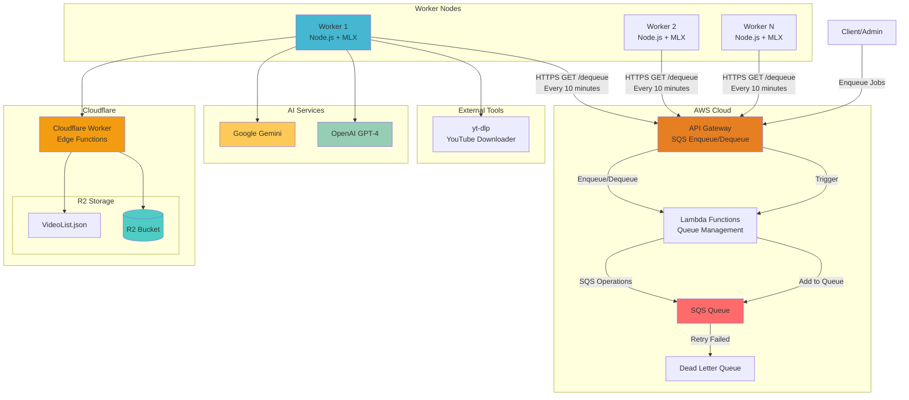
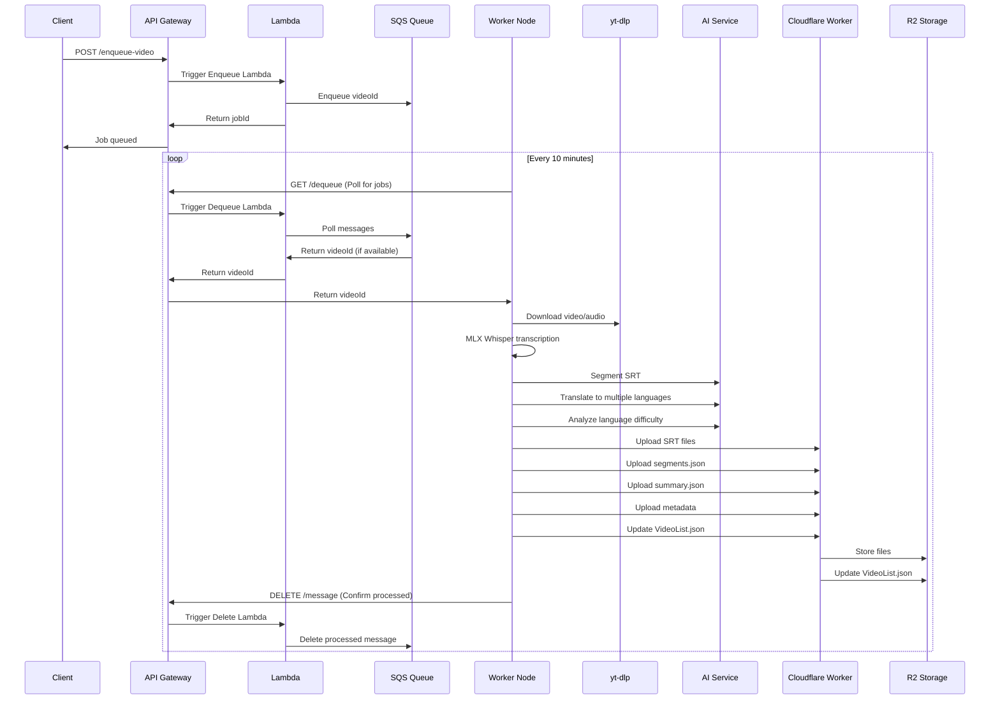

# Whisper AI Video Processing Pipeline

> Enterprise-grade AI-driven YouTube video processing system with Clean Architecture and event-driven design

## 🎯 System Overview

An automated video processing platform built on Whisper AI that delivers a complete workflow from YouTube videos to multilingual subtitles. The system employs microservices architecture with horizontal scaling and fault tolerance capabilities.

### Key Features
- **🤖 Fully Automated Pipeline** - SQS-driven unattended video processing
- **🏗️ Clean Architecture** - Strict layered architecture with dependency injection
- **🌐 Multilingual Support** - AI-powered intelligent translation and segmentation
- **☁️ Cloud-Native Design** - Cloudflare R2 storage + AWS SQS queuing
- **⚡ High-Performance Transcription** - MLX Whisper (Apple Silicon optimized)
- **📊 Language Difficulty Analysis** - AI-powered content learning difficulty assessment

## 🔄 Cloud Architecture & Workflow

### System Architecture



### Processing Flow



### Processing Stages

1. **📥 Job Enqueuing** - Client submits YouTube video IDs via API Gateway to SQS queue
2. **🔄 HTTP Polling** - Worker nodes poll API Gateway `/dequeue` endpoint every 10 minutes via HTTPS GET
3. **⬇️ Video Download** - Download audio and metadata using `yt-dlp`
4. **🎙️ Speech Transcription** - Generate high-precision SRT subtitles with MLX Whisper
5. **✂️ Intelligent Segmentation** - AI-powered segmentation of long subtitles into topic-based segments
6. **🌍 Multilingual Translation** - Automatic translation to target languages (zh-TW, ja, ko, etc.)
7. **📈 Language Analysis** - AI assessment of content learning difficulty
8. **☁️ Cloud Storage** - Structured upload to Cloudflare R2
9. **📋 Index Update** - Update VideoList.json master index

## 🛠️ Technical Stack

- **Backend Framework**: TypeScript + Node.js + Express
- **AI Engine**: MLX Whisper (Apple Silicon optimized) / Whisper.cpp
- **AI Services**: OpenAI GPT-4 / Google Gemini
- **Message Queue**: AWS SQS (Event-driven architecture)
- **Cloud Storage**: Cloudflare R2 (S3-compatible)
- **Real-time Communication**: Socket.IO (Progress streaming)
- **Containerization**: Docker + Docker Compose

## 🚀 Quick Start

### Prerequisites

- **Node.js** 18+
- **Python** 3.11+ (MLX Whisper requirement)
- **Apple Silicon** (M1/M2/M3 recommended for MLX optimization)
- **uv/uvx** (Python package management)

### Installation

1. **Clone Repository**
```bash
git clone <repository-url>
cd whisper-node-backend
```

2. **Install Dependencies**
```bash
npm install
```

3. **Python Environment Setup**
```bash
# Install uv (Python package manager)
curl -LsSf https://astral.sh/uv/install.sh | sh

# MLX Whisper will be auto-installed on first use
```

4. **Environment Configuration**
```bash
cp .env.example .env
# Edit .env to configure API keys and storage settings
```

5. **Start Services**
```bash
# Development mode (auto-reload)
npm run dev

# Production mode
npm run build
npm start
```

### Environment Variables

```bash
# Server Configuration
PORT=8001

# Storage Configuration
STORAGE_TYPE=r2                    # local | r2
R2_BUCKET_NAME=your_bucket_name

# AI Service Configuration
OPENAI_API_KEY=your_openai_key
GEMINI_API_KEY=your_gemini_key
AI_PROVIDER=gemini                 # openai | gemini

# SQS Auto Processing Configuration
SQS_AUTO_SEGMENT=true             # Auto segmentation
SQS_AUTO_TRANSLATE=true           # Auto translation
SQS_AUTO_LANGUAGE_ANALYSIS=true   # Auto language analysis
SQS_TARGET_LANGUAGES=zh-TW,ja,ko  # Target translation languages
SQS_SEGMENT_COUNT=6               # Target segment count
SQS_AI_SERVICE=gemini             # AI service selection
```

## 📡 API Endpoints

### Core Transcription APIs

```bash
# YouTube Video Transcription (MLX Whisper)
POST /api/transcribe-youtube-mlx
Content-Type: application/json
{
  "url": "https://www.youtube.com/watch?v=VIDEO_ID",
  "language": "auto"
}

# Audio File Transcription
POST /api/transcribe-mlx
Content-Type: multipart/form-data
# Upload WAV file

# YouTube to SRT Conversion
POST /api/youtube-to-srt
{
  "url": "https://www.youtube.com/watch?v=VIDEO_ID"
}
```

### SRT Processing APIs

```bash
# SRT Intelligent Segmentation
POST /api/srt/segment
{
  "videoId": "VIDEO_ID",
  "language": "default",
  "targetSegmentCount": 6,
  "aiService": "gemini"
}

# SRT Translation
POST /api/srt/translate
{
  "videoId": "VIDEO_ID",
  "sourceLanguage": "default",
  "targetLanguage": "zh-TW",
  "aiService": "gemini"
}

# Get Segmentation Results
GET /api/srt/segmentation/{videoId}/{language}

# Get SRT Content
GET /api/srt/{videoId}/{language}
```

### Batch Processing APIs

```bash
# Batch Process Multiple Videos
POST /api/batch/process-multiple
{
  "videoIds": ["VIDEO_ID_1", "VIDEO_ID_2"],
  "options": {
    "autoSegment": true,
    "autoTranslate": true,
    "targetLanguages": ["zh-TW", "ja"]
  }
}

# Process from R2 VideoList
POST /api/batch/process-from-r2

# Check Batch Job Status
GET /api/batch/status/{jobId}

# List All Batch Jobs
GET /api/batch/jobs
```

### Language Analysis APIs

```bash
# Batch Language Difficulty Analysis
POST /api/batch-analyze-language-level
{
  "videoIds": ["VIDEO_ID_1", "VIDEO_ID_2"],
  "aiService": "gemini"
}

# Get Language Analysis Results
GET /api/language-analysis/{videoId}

# Get Analysis Statistics
GET /api/language-analysis/stats
```

## 🏗️ Architecture Highlights

### Clean Architecture Implementation
- **Controllers**: Handle HTTP/WebSocket requests only
- **Use Cases**: Orchestrate business workflows
- **Services**: Implement single business capabilities
- **Repositories**: Abstract storage operations behind interfaces
- **Domain**: Core entities and repository interfaces

### Event-Driven Design
- **SQS Integration**: Decoupled video processing workflows
- **HTTP Polling**: Worker nodes poll API Gateway every 10 minutes
- **Dead Letter Queue**: Failed job handling and retry mechanisms
- **Horizontal Scaling**: Multiple worker nodes for load distribution

### Cloud-Native Architecture
- **Cloudflare R2**: S3-compatible object storage
- **Cloudflare Workers**: Edge functions for storage operations
- **AWS Lambda**: Serverless queue management
- **API Gateway**: Unified entry point for SQS operations

## 🐳 Deployment

### Docker Deployment

```bash
# Build Image
docker build -t whisper-backend .

# Run Container
docker run -d \
  --name whisper-backend \
  -p 8001:8001 \
  -v $(pwd)/uploads:/app/uploads \
  --env-file .env \
  whisper-backend
```

### Production Configuration

1. **Environment Setup** - Configure R2 storage and AI API keys
2. **SQS Queue Setup** - Create AWS SQS queue and API Gateway
3. **Load Balancing** - Use Nginx or CloudFlare for load balancing
4. **Monitoring** - Integrate CloudWatch or other monitoring services

## 📊 Monitoring & Health Checks

### Health Check Endpoints

```bash
# Basic Health Check
GET /health

# MLX Whisper Service Check
GET /api/mlx-health
```

### Structured Logging

- **SQS Processing Logs** - Job acquisition and processing status
- **Transcription Progress** - MLX Whisper processing progress
- **AI Service Logs** - OpenAI/Gemini API call status
- **Storage Operation Logs** - R2 upload/download status

## 📄 License

MIT License - See [LICENSE](LICENSE) file for details

---

**🎯 Project Highlights**
- Enterprise-grade Clean Architecture design
- Event-driven microservices architecture
- AI-powered intelligent content processing
- Cloud-native scalable design
- Complete automated workflow pipeline