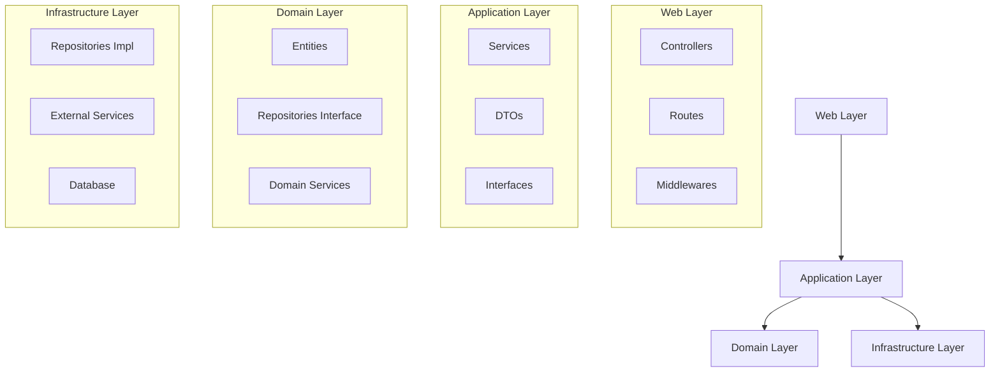

# 專案架構設計文檔

## 目錄

1. [概述](#概述)
2. [架構設計](#架構設計)
3. [目錄結構](#目錄結構)
4. [設計模式與最佳實踐](#設計模式與最佳實踐)
5. [實施計劃](#實施計劃)

## 概述

本文檔描述了專案的建議架構設計，採用 Clean Architecture 結合 MVC 模式，以實現高內聚低耦合、可測試性和可維護性。

## 架構設計

### Clean Architecture + MVC 分層



### 層級職責

1. **Web Layer (表現層)**
   - 處理 HTTP 請求和 WebSocket 連接
   - 請求參數驗證
   - 路由管理
   - 錯誤處理
   - 響應格式化

2. **Application Layer (應用層)**
   - 協調業務流程
   - 實現用例邏輯
   - 數據轉換（DTO）
   - 事務管理

3. **Domain Layer (領域層)**
   - 定義核心業務模型
   - 業務規則驗證
   - 領域事件
   - 領域服務

4. **Infrastructure Layer (基礎設施層)**
   - 外部服務整合（Whisper, YouTube）
   - 數據持久化
   - 第三方庫適配
   - 技術服務實現

## 目錄結構

```
src/
├── presentation/           # Web Layer
│   ├── controllers/       # HTTP & WebSocket 控制器
│   │   ├── TranscriptionController.ts
│   │   └── YoutubeController.ts
│   ├── routes/           # 路由定義
│   │   └── api.routes.ts
│   ├── middlewares/      # 中間件
│   │   ├── errorHandler.ts
│   │   └── validator.ts
│   └── validators/       # 請求驗證
│       └── transcription.validator.ts
├── application/          # Application Layer
│   ├── services/        # 業務邏輯服務
│   │   ├── TranscriptionService.ts
│   │   └── YoutubeService.ts
│   ├── dtos/           # 數據傳輸對象
│   │   └── TranscriptionDto.ts
│   └── interfaces/      # 服務接口定義
│       └── ITranscriptionService.ts
├── domain/              # Domain Layer
│   ├── entities/       # 領域模型
│   │   └── Transcription.ts
│   ├── repositories/   # 儲存庫接口
│   │   └── ITranscriptionRepository.ts
│   └── services/       # 領域服務
│       └── TranscriptionDomainService.ts
├── infrastructure/      # Infrastructure Layer
│   ├── repositories/   # 儲存庫實現
│   │   └── TranscriptionRepository.ts
│   ├── external/       # 外部服務
│   │   ├── whisper/
│   │   └── youtube/
│   └── persistence/    # 數據持久化
│       └── models/
└── shared/             # 共享功能
    ├── config/         # 配置
    ├── utils/          # 工具函數
    └── types/          # 類型定義
```

## 設計模式與最佳實踐

### 1. 依賴注入模式

```typescript
// 服務類型定義
type WhisperService = {
  transcribe: (params: WhisperParams) => Promise<WhisperResult>;
};

// 創建服務
const createWhisperService = (
  config: WhisperConfig,
  logger: Logger
): WhisperService => {
  const transcribe = async (params: WhisperParams): Promise<WhisperResult> => {
    logger.info('Starting transcription', params);
    // 實現邏輯
    return result;
  };

  return { transcribe };
};

// 使用服務
const whisperService = createWhisperService(config, logger);
```

### 2. Repository 模式

```typescript
// Repository 類型定義
type TranscriptionRepository = {
  save: (transcription: Transcription) => Promise<void>;
  findById: (id: string) => Promise<Transcription>;
  // 其他方法
};

// 創建 Repository
const createTranscriptionRepository = (db: Database): TranscriptionRepository => {
  const save = async (transcription: Transcription): Promise<void> => {
    // 實現儲存邏輯
  };

  const findById = async (id: string): Promise<Transcription> => {
    // 實現查詢邏輯
  };

  return { save, findById };
};
```

### 3. 工廠模式

```typescript
type TranscriptionService = {
  process: (input: TranscriptionInput) => Promise<TranscriptionResult>;
};

const createTranscriptionService = (type: TranscriptionType): TranscriptionService => {
  switch (type) {
    case 'FILE':
      return createFileTranscriptionService();
    case 'YOUTUBE':
      return createYoutubeTranscriptionService();
    default:
      throw new Error('Unknown transcription type');
  }
};

// 使用工廠
const transcriptionService = createTranscriptionService('FILE');
```

### 4. 事件發布/訂閱

```typescript
type EventHandler = (data: any) => void;
type EventEmitter = {
  emit: (event: string, data: any) => void;
  on: (event: string, handler: EventHandler) => void;
  off: (event: string, handler: EventHandler) => void;
};

const createEventEmitter = (): EventEmitter => {
  const handlers: Record<string, EventHandler[]> = {};

  const emit = (event: string, data: any): void => {
    if (handlers[event]) {
      handlers[event].forEach(handler => handler(data));
    }
  };

  const on = (event: string, handler: EventHandler): void => {
    if (!handlers[event]) {
      handlers[event] = [];
    }
    handlers[event].push(handler);
  };

  const off = (event: string, handler: EventHandler): void => {
    if (handlers[event]) {
      handlers[event] = handlers[event].filter(h => h !== handler);
    }
  };

  return { emit, on, off };
};
```

## 實施計劃

### 階段1：基礎架構搭建
1. 設置新的目錄結構
2. 實現依賴注入容器
3. 定義核心接口

### 階段2：領域模型實現
1. 實現領域實體
2. 創建儲存庫接口和實現
3. 實現領域服務

### 階段3：應用服務重構
1. 重構現有服務到新架構
2. 實現新的應用服務
3. 添加事務管理

### 階段4：表現層優化
1. 實現新的控制器結構
2. 重構 WebSocket 處理
3. 添加請求驗證

### 階段5：測試與文檔
1. 單元測試覆蓋
2. 集成測試實現
3. API 文檔更新
