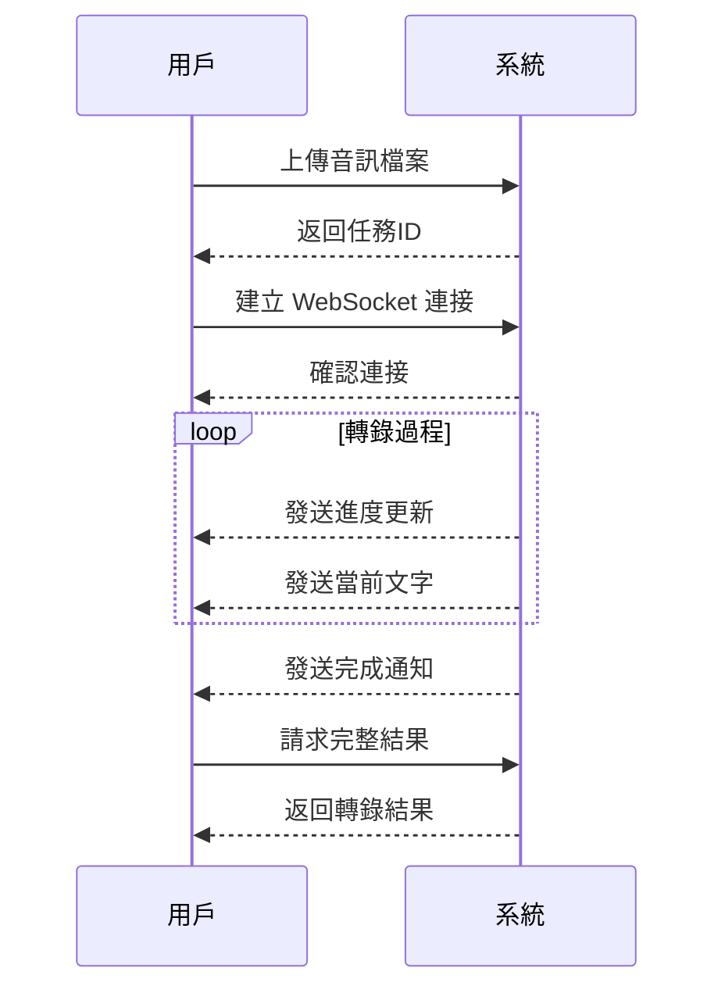

# Whisper CPP Node.js 後端服務 - 產品需求文件 (PRD)

## 1. 產品概述

### 1.1 產品目標
建立一個基於 Whisper 的高效能音訊轉錄後端服務，提供即時轉錄進度回饋和完整的 API 接口。

### 1.2 目標用戶
- 開發者
- 需要音訊轉錄功能的應用程式
- 需要即時轉錄進度的使用場景

## 2. 功能需求

### 2.1 核心功能
- 音訊檔案上傳和轉錄
  - 支援多種音訊格式
  - 提供轉錄任務狀態查詢
  - 即時回傳轉錄進度

- 即時進度回饋
  - WebSocket 連接狀態顯示
  - 轉錄進度百分比
  - 當前轉錄文字預覽

- 結果管理
  - 完整轉錄文字下載
  - 帶時間戳的字幕格式
  - 錯誤通知和處理

### 2.2 使用者界面需求
- RESTful API 接口
  - 直觀的端點命名
  - 清晰的請求/回應格式
  - 詳細的錯誤訊息

- WebSocket 事件
  - 連接狀態反饋
  - 進度更新通知
  - 錯誤狀態提示

## 3. 使用者體驗

### 3.1 效能期望
- 上傳回應時間：< 2 秒
- 轉錄開始時間：< 5 秒
- 進度更新頻率：至少每秒一次
- 完整轉錄時間：不超過音訊長度的 1/2

### 3.2 使用流程

## 4. 功能限制

### 4.1 檔案限制
- 支援的音訊格式
  - WAV
  - MP3
  - M4A
- 檔案大小上限：100MB
- 音訊長度上限：30 分鐘

### 4.2 系統限制
- 最大並發轉錄數：5
- 單一用戶請求頻率：每分鐘 10 次
- 轉錄超時時間：45 分鐘

## 5. 錯誤處理

### 5.1 用戶提示
- 檔案格式錯誤提示
- 檔案大小超限提示
- 轉錄失敗提示
- 連接斷開重連提示

### 5.2 系統回復
- 自動重試機制
- 錯誤記錄
- 系統狀態通知

## 6. 未來擴展

### 6.1 潛在功能
- 多語言支援
- 自訂模型選擇
- 批次處理功能
- 轉錄結果編輯

### 6.2 系統優化
- 快取機制
- 負載平衡
- 資源使用優化
- 音訊處理效能優化

## 7. 成功指標

### 7.1 性能指標
- 轉錄準確率 > 95%
- 系統可用性 > 99.9%
- 用戶響應時間 < 1秒

### 7.2 使用者指標
- API 使用量
- 轉錄成功率
- 用戶滿意度
