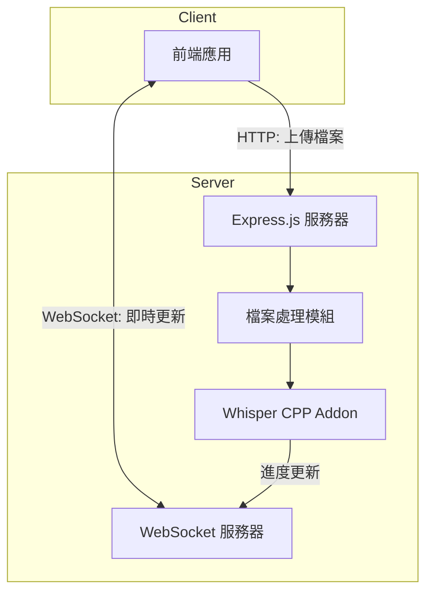

# Whisper CPP Node.js 後端服務 - 技術需求文件 (TRD)

## 1. 系統概述
建立一個基於 Whisper CPP 的 Node.js 後端服務，提供音訊檔案轉錄功能，並通過 WebSocket 實現即時進度回饋。

## 2. 技術架構

### 2.1 核心組件
- **後端框架**: Express.js
- **WebSocket 服務**: Socket.IO/ws
- **音訊轉錄**: Whisper Node Addon
- **檔案處理**: Multer

### 2.2 系統架構圖


## 3. 詳細技術規格

### 3.1 API 端點
```typescript
// HTTP 端點
POST /api/upload
- Content-Type: multipart/form-data
- 參數：音訊檔案
- 回應：{ jobId: string }

GET /api/status/:jobId
- 回應：{ status: string, progress: number }

// WebSocket 事件
interface TranscriptionProgress {
    jobId: string;
    progress: number;    // 0-100
    currentText: string; // 當前轉錄文字
}

interface TranscriptionComplete {
    jobId: string;
    text: string;       // 完整轉錄文字
    segments: Array<{   // 時間戳記區段
        start: number;
        end: number;
        text: string;
    }>;
}

interface TranscriptionError {
    jobId: string;
    error: string;
}
```

### 3.2 Socket.IO 事件規範
```typescript
// 伺服器端設置
const io = new Server(httpServer, {
    cors: {
        origin: process.env.FRONTEND_URL,
        methods: ['GET', 'POST']
    },
    pingTimeout: 60000,
    pingInterval: 25000
});

// 事件處理
io.on('connection', (socket) => {
    // 處理重連
    socket.on('reconnect', (attemptNumber) => {
        if (activeJobs.has(socket.id)) {
            // 恢復工作狀態
            const job = activeJobs.get(socket.id);
            socket.emit('transcription-progress', {
                jobId: socket.id,
                progress: job.progress
            });
        }
    });

    // 音訊轉錄事件
    socket.on('start-transcription', async (data) => {
        const roomId = `transcription:${socket.id}`;
        socket.join(roomId);
        socket.emit('transcription-start', { jobId: socket.id });
    });
    
    // 音訊片段處理
    socket.on('audio-chunk', (data: {
        chunk: Float32Array,
        timestamp: number,
        sequence: number
    }) => {
        // 處理音訊片段
        io.to(`transcription:${socket.id}`).emit('transcription-progress', {
            jobId: socket.id,
            progress: calculateProgress(data.sequence),
            currentText: getCurrentText()
        });
    });
});

// 客戶端使用
const socket = io('http://localhost:3000', {
    reconnection: true,
    reconnectionAttempts: 5,
    reconnectionDelay: 1000,
    timeout: 20000
});

// 監聽事件
socket.on('connect', () => {
    console.log('已連接到伺服器');
});

socket.on('transcription-progress', (data: TranscriptionProgress) => {
    console.log(`轉錄進度：${data.progress}%`);
    console.log(`當前文字：${data.currentText}`);
});

socket.on('transcription-complete', (data: TranscriptionComplete) => {
    console.log('轉錄完成：', data.text);
});

socket.on('disconnect', () => {
    console.log('連接已斷開，正在嘗試重新連接...');
});
```

### 3.3 Node.js C++ Addon 介面
```typescript
// 使用現有的 addon.node 介面
interface WhisperParams {
    language: string;            // 語言設定
    model: string;              // 模型路徑
    fname_inp: string;          // 輸入檔案
    use_gpu: boolean;           // 是否使用 GPU
    flash_attn: boolean;        // 是否使用 Flash Attention
    no_prints: boolean;         // 是否禁用列印
    comma_in_time: boolean;     // 時間戳記是否使用逗號
    translate: boolean;         // 是否進行翻譯
    no_timestamps: boolean;     // 是否禁用時間戳記
    audio_ctx: number;          // 音訊上下文大小
    max_len: number;           // 最大長度限制
    progress_callback?: (progress: number) => void;  // 進度回調
    pcmf32?: Float32Array;     // PCM 音訊數據
}

// 使用範例
const params: WhisperParams = {
    language: 'zh',
    model: './models/ggml-large.bin',
    use_gpu: true,
    pcmf32: audioBuffer,
    progress_callback: (progress) => {
        console.log(`轉錄進度: ${progress}%`);
    }
};

const result = await whisperAsync(params);
```

## 4. 效能需求

### 4.1 系統效能
- 並發處理：支援最少 5 個同時轉錄請求
- 記憶體使用：每個轉錄工作最大 2GB RAM
- WebSocket 延遲：< 100ms

### 4.2 檔案處理限制
- 支援格式：.wav, .mp3, .m4a
- 檔案大小：最大 100MB
- 音訊長度：最大 30 分鐘

## 5. 錯誤處理

### 5.1 錯誤類型
```typescript
enum TranscriptionErrorType {
    FILE_TOO_LARGE = 'FILE_TOO_LARGE',
    INVALID_FORMAT = 'INVALID_FORMAT',
    PROCESSING_ERROR = 'PROCESSING_ERROR',
    TIMEOUT = 'TIMEOUT'
}
```

### 5.2 錯誤回應格式
```typescript
interface ErrorResponse {
    error: TranscriptionErrorType;
    message: string;
    jobId?: string;
    timestamp: number;
}
```

## 6. 安全考量
- 檔案類型驗證
- WebSocket 連接認證
- 請求速率限制
- 檔案大小限制

## 7. 開發階段

### 7.1 第一階段：基礎建設
- Express.js 專案設置
- WebSocket 服務器配置
- 檔案上傳處理

### 7.2 第二階段：核心功能
- 音訊轉錄服務整合
- 轉錄功能實作
- WebSocket 事件處理

### 7.3 第三階段：優化和測試
- 效能優化
- 錯誤處理
- 單元測試

## 8. 測試規範

### 8.1 單元測試
- 轉錄功能測試
- WebSocket 事件測試
- API 端點測試

### 8.2 整合測試
- 完整轉錄流程測試
- 錯誤處理測試
- 併發處理測試

### 8.3 效能測試
- 負載測試
- 記憶體使用監控
- 響應時間測試
